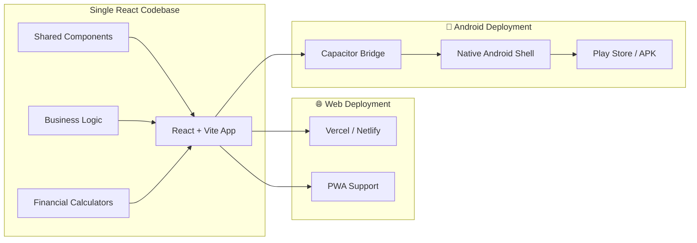
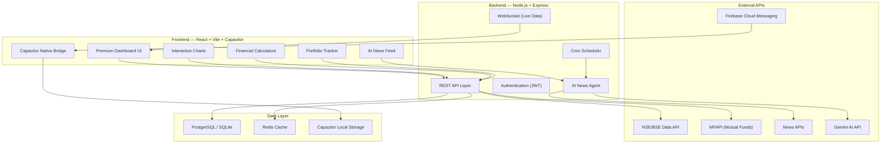
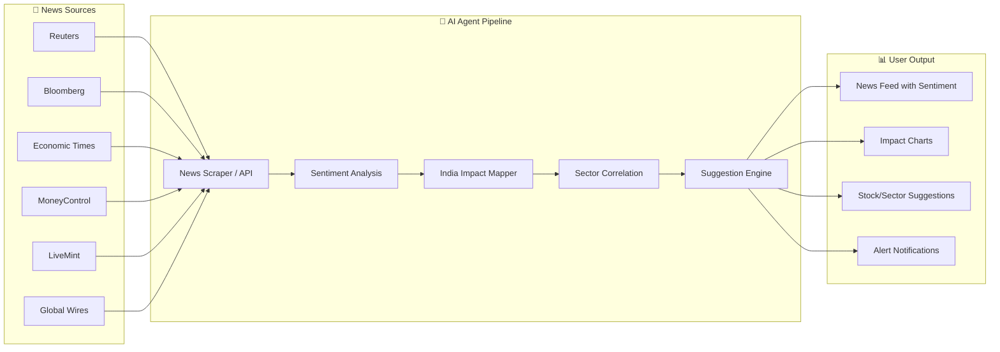

# 🏦 DhanSaathi — Indian Financial Advisory Platform

> **"Your Intelligent Wealth Companion"**

A premium, all-in-one financial advisory **multi-platform application** (Web + Android) built for Indian investors — covering SIP, Mutual Funds, ETFs, Stocks, and F&O with real-time tracking, smart calculators, and an AI-powered news agent that delivers actionable market insights.

---

## 🌐 Multi-Platform Strategy

### Why One Codebase → Two Platforms?

We use **React + Vite** for the web app and **Capacitor** to wrap the same codebase into a native Android APK. This gives us:

- ✅ **Single codebase** — Write once, deploy to Web & Android
- ✅ **Native Android features** — Push notifications, offline storage, biometric auth
- ✅ **PWA fallback** — Users can install from browser too
- ✅ **Shared business logic** — Calculators, formatters, API calls work everywhere
- ✅ **Native-feel UI** — Capacitor provides native bridge for Android APIs



### Platform-Specific Features

| Feature | Web | Android |
|---------|-----|---------|
| Full Dashboard | ✅ | ✅ |
| All Calculators | ✅ | ✅ |
| Knowledge Hub | ✅ | ✅ |
| AI News Agent | ✅ | ✅ |
| Portfolio Tracker | ✅ | ✅ |
| Push Notifications | Browser API | Firebase FCM (native) |
| Offline Mode | Service Worker | Capacitor Storage |
| Biometric Lock | ❌ | Fingerprint/Face (native) |
| Share to Apps | Web Share API | Native Android Share |
| Home Screen Widget | ❌ | Android Widget (Phase 5) |
| App Store Distribution | N/A | Play Store APK |

---

## 📐 Architecture Overview



---

## 🎯 Core Feature Modules

### 1. 📚 Knowledge Hub — Indian Market Education

> Teach users everything about Indian financial instruments with interactive, visual content.

| Topic | Content |
|-------|---------|
| **SIP** | What is SIP, Power of compounding, SIP vs Lumpsum, Step-up SIP, SIP in different market conditions |
| **Mutual Funds** | Types (Equity, Debt, Hybrid, ELSS, Index), NAV explained, Expense Ratio, Direct vs Regular, Exit Load, SEBI categories |
| **ETFs** | How ETFs work, Gold ETFs, Nifty/Sensex ETFs, Tracking Error, Liquidity, ETF vs Index Funds |
| **Stocks** | Fundamental Analysis, Technical Analysis, Candlestick patterns, P/E Ratio, Market Cap classification, Sectors |
| **F&O** | Futures basics, Options (Call/Put), Greeks (Delta, Gamma, Theta, Vega), Strategies (Straddle, Strangle, Iron Condor, Bull/Bear spreads), Margin requirements, Lot sizes |

**UI Design:**
- Interactive cards with animated illustrations
- Glossary with search
- Difficulty levels (Beginner → Advanced)
- Quiz system to test knowledge
- Bookmark and progress tracking

---

### 2. 📊 Portfolio Tracker

> Track all investments in one unified dashboard with real-time data.

| Feature | Description |
|---------|-------------|
| **Multi-Asset Dashboard** | Unified view of Stocks, MFs, ETFs, SIPs, and F&O positions |
| **Real-Time Prices** | Live price updates from NSE/BSE during market hours |
| **P&L Analysis** | Realized & Unrealized gains, XIRR returns, Absolute returns |
| **Asset Allocation** | Pie chart showing distribution across asset classes |
| **Holdings View** | Detailed table — Buy price, Current price, Quantity, % Change, Total value |
| **SIP Tracker** | Active SIPs with next installment date, total invested, current value, returns |
| **F&O Positions** | Open positions with Greeks, margin used, MTM P&L |
| **Watchlist** | Custom watchlists with price alerts |
| **Transaction History** | Full buy/sell log with filters |
| **Tax Summary** | STCG/LTCG computation, dividend income tracking |

**Data Sources:**
- **Stocks/ETFs:** NSE India API / Yahoo Finance API
- **Mutual Funds:** MFAPI.in (free, covers all AMFI registered funds)
- **F&O:** NSE Derivatives data

---

### 3. 🧮 Financial Calculators

> Comprehensive calculator suite for Indian investors.

| Calculator | Inputs | Outputs |
|-----------|--------|---------|
| **SIP Calculator** | Monthly amount, Duration, Expected return % | Future value, Total invested, Wealth gained, Growth chart |
| **Lumpsum Calculator** | Principal, Duration, Rate | Maturity value, Growth chart |
| **Step-up SIP** | Initial amount, Annual increase %, Duration, Rate | Year-wise breakdown, Final corpus |
| **SWP Calculator** | Corpus, Monthly withdrawal, Rate | Duration corpus lasts, Remaining balance chart |
| **XIRR Calculator** | Cash flows (dates + amounts) | Actual annualized return |
| **CAGR Calculator** | Initial value, Final value, Duration | CAGR %, comparison with benchmarks |
| **F&O Margin Calculator** | Scrip, Lot size, Position type | SPAN margin, Exposure margin, Total required |
| **Options Payoff** | Strike, Premium, Position (Buy/Sell), Call/Put | Payoff diagram, Breakeven, Max Profit/Loss |
| **Tax Calculator** | Gains type, Holding period, Amount | Tax liability (STCG 20%, LTCG 12.5% above ₹1.25L) |
| **Goal Planner** | Target amount, Timeline, Risk profile | Required monthly SIP, Suggested allocation |
| **EMI Calculator** | Loan amount, Interest rate, Tenure | EMI, Total interest, Amortization schedule |
| **Inflation Calculator** | Current cost, Inflation rate, Years | Future cost, Purchasing power loss |

**UI Features:**
- Interactive sliders with real-time graph updates
- Exportable results (PDF)
- Side-by-side comparison mode
- Save & share calculations

---

### 4. 🤖 AI News Agent — Market Intelligence Engine

> An autonomous AI agent that monitors global news 24/7 and generates actionable investment insights for Indian investors.



#### Agent Capabilities:

| Capability | Description |
|-----------|-------------|
| **Real-time News Feed** | Aggregated, deduplicated news from 15+ Indian & global sources |
| **Sentiment Scoring** | Each news item scored -1.0 (very bearish) to +1.0 (very bullish) |
| **India Impact Analysis** | Maps global events to Indian sectors (e.g., "US Fed rate hike → IT stocks impact") |
| **Sector Heat Map** | Visual heat map showing which sectors are bullish/bearish based on news |
| **Stock Suggestions** | AI-generated suggestions with reasoning: "Buy/Hold/Sell" with confidence score |
| **Chart Annotations** | News events plotted on stock price charts showing correlation |
| **Alert System** | Push notifications for breaking news that affects user's portfolio |
| **Weekly AI Report** | Auto-generated weekly market summary with outlook |

#### AI Agent Technical Pipeline:

```
┌─────────────────────────────────────────────┐
│              AI Agent Pipeline              │
├─────────────────────────────────────────────┤
│                                             │
│  1. COLLECT  → Cron job every 15 minutes    │
│     - Fetch from News APIs                  │
│     - RSS feed parsing                      │
│     - Social media signals (X/Twitter)      │
│                                             │
│  2. PROCESS  → NLP + LLM Analysis           │
│     - Deduplicate similar stories           │
│     - Extract entities (companies, sectors) │
│     - Sentiment analysis (FinBERT / Gemini) │
│     - Classify: Macro/Sector/Stock level    │
│                                             │
│  3. CORRELATE → India Market Mapping        │
│     - Map to NSE sectors & stocks           │
│     - Historical pattern matching           │
│     - Cross-reference with F&O data         │
│                                             │
│  4. SUGGEST → Investment Recommendations    │
│     - Risk-adjusted suggestions             │
│     - Entry/Exit points                     │
│     - Confidence scoring                    │
│     - Portfolio impact analysis             │
│                                             │
│  5. DELIVER → Multi-channel Output          │
│     - Dashboard charts & cards              │
│     - Push notifications (FCM for Android)  │
│     - Email digests                         │
│     - Weekly AI report generation           │
│                                             │
└─────────────────────────────────────────────┘
```

---

## 🎨 UI/UX Design System

### Design Philosophy
- **Premium Dark Theme** with accent gradients (Deep navy → Electric blue → Emerald green)
- **Glassmorphism** cards with frosted glass effects
- **Micro-animations** on all interactions
- **Mobile-first** responsive design (Android app shares the same UI)
- **Data-dense but clean** — inspired by Bloomberg Terminal meets modern fintech

### Color Palette

| Token | Color | Usage |
|-------|-------|-------|
| `--bg-primary` | `#0a0e1a` | Main background |
| `--bg-secondary` | `#111827` | Card backgrounds |
| `--bg-glass` | `rgba(17, 24, 39, 0.7)` | Glassmorphism panels |
| `--accent-green` | `#10b981` | Profit, positive changes |
| `--accent-red` | `#ef4444` | Loss, negative changes |
| `--accent-blue` | `#3b82f6` | Primary actions, links |
| `--accent-purple` | `#8b5cf6` | AI agent elements |
| `--accent-gold` | `#f59e0b` | Premium features, highlights |
| `--text-primary` | `#f9fafb` | Main text |
| `--text-secondary` | `#9ca3af` | Muted text |

### Key Screens

1. **Dashboard** — Portfolio summary, market indices (Nifty 50, Sensex, Bank Nifty), top movers, AI insights ticker
2. **Markets** — Live market data, sector performance, indices, heatmaps
3. **Portfolio** — Holdings, P&L, asset allocation, SIP tracker
4. **Calculators** — All 12 calculators in a tabbed/grid layout
5. **Knowledge** — Interactive learning modules
6. **AI Insights** — News feed, sentiment dashboard, suggestions, chart annotations
7. **Settings** — Profile, notifications, theme preferences

---

## 🛠 Tech Stack

| Layer | Technology | Why |
|-------|-----------|-----|
| **Frontend** | Vite + React 18 | Fast dev, modern tooling |
| **Android Wrapper** | Capacitor 6 | Native Android from web codebase |
| **Styling** | Vanilla CSS + CSS Variables | Full design control, premium feel |
| **Charts** | Recharts + Lightweight Charts (TradingView) | Interactive financial charts |
| **State** | Zustand | Lightweight, simple state management |
| **Routing** | React Router v6 | Client-side navigation |
| **Backend** | Node.js + Express | Fast API development |
| **Real-time** | Socket.io | WebSocket for live price updates |
| **Database** | SQLite (dev) / PostgreSQL (prod) | Flexible, reliable |
| **AI/LLM** | Google Gemini API | News analysis, suggestions |
| **News** | NewsAPI.org + RSS feeds | Global news aggregation |
| **Market Data** | MFAPI.in + NSE Unofficial API | Indian market data |
| **Auth** | JWT + bcrypt | Secure authentication |
| **Push Notifs** | Firebase Cloud Messaging | Android push notifications |
| **Scheduler** | node-cron | Periodic news fetching |
| **Web Hosting** | Vercel (FE) + Railway (BE) | Easy deployment |
| **Android Build** | Android Studio + Gradle | APK/AAB generation |

---

## 📦 Project Structure

```
d:\PROJECTS\FINANCIALPROJ\
│
├── client/                          # Frontend (Vite + React + Capacitor)
│   ├── public/
│   │   ├── favicon.svg
│   │   └── assets/
│   ├── src/
│   │   ├── main.jsx
│   │   ├── App.jsx
│   │   ├── index.css                # Global design system
│   │   ├── components/
│   │   │   ├── layout/
│   │   │   │   ├── Sidebar.jsx
│   │   │   │   ├── BottomNav.jsx    # Mobile/Android bottom navigation
│   │   │   │   ├── Header.jsx
│   │   │   │   └── Layout.jsx
│   │   │   ├── dashboard/
│   │   │   │   ├── MarketOverview.jsx
│   │   │   │   ├── PortfolioSummary.jsx
│   │   │   │   ├── TopMovers.jsx
│   │   │   │   └── AIInsightsTicker.jsx
│   │   │   ├── portfolio/
│   │   │   │   ├── Holdings.jsx
│   │   │   │   ├── SIPTracker.jsx
│   │   │   │   ├── FOPositions.jsx
│   │   │   │   ├── AssetAllocation.jsx
│   │   │   │   └── TransactionHistory.jsx
│   │   │   ├── calculators/
│   │   │   │   ├── SIPCalculator.jsx
│   │   │   │   ├── LumpsumCalculator.jsx
│   │   │   │   ├── StepUpSIP.jsx
│   │   │   │   ├── SWPCalculator.jsx
│   │   │   │   ├── XIRRCalculator.jsx
│   │   │   │   ├── CAGRCalculator.jsx
│   │   │   │   ├── MarginCalculator.jsx
│   │   │   │   ├── OptionsPayoff.jsx
│   │   │   │   ├── TaxCalculator.jsx
│   │   │   │   ├── GoalPlanner.jsx
│   │   │   │   ├── EMICalculator.jsx
│   │   │   │   └── InflationCalculator.jsx
│   │   │   ├── knowledge/
│   │   │   │   ├── TopicCard.jsx
│   │   │   │   ├── ArticleView.jsx
│   │   │   │   ├── Glossary.jsx
│   │   │   │   └── Quiz.jsx
│   │   │   ├── ai-agent/
│   │   │   │   ├── NewsFeed.jsx
│   │   │   │   ├── SentimentDashboard.jsx
│   │   │   │   ├── SectorHeatMap.jsx
│   │   │   │   ├── StockSuggestions.jsx
│   │   │   │   ├── ChartAnnotations.jsx
│   │   │   │   └── WeeklyReport.jsx
│   │   │   ├── markets/
│   │   │   │   ├── LiveIndices.jsx
│   │   │   │   ├── SectorPerformance.jsx
│   │   │   │   └── StockScreener.jsx
│   │   │   └── ui/
│   │   │       ├── GlassCard.jsx
│   │   │       ├── AnimatedCounter.jsx
│   │   │       ├── Sparkline.jsx
│   │   │       ├── SearchBar.jsx
│   │   │       └── Tooltip.jsx
│   │   ├── pages/
│   │   │   ├── Dashboard.jsx
│   │   │   ├── Markets.jsx
│   │   │   ├── Portfolio.jsx
│   │   │   ├── Calculators.jsx
│   │   │   ├── Knowledge.jsx
│   │   │   ├── AIInsights.jsx
│   │   │   └── Settings.jsx
│   │   ├── hooks/
│   │   │   ├── useMarketData.js
│   │   │   ├── usePortfolio.js
│   │   │   ├── useNewsAgent.js
│   │   │   └── usePlatform.js       # Detect web vs Android
│   │   ├── store/
│   │   │   ├── portfolioStore.js
│   │   │   ├── marketStore.js
│   │   │   └── settingsStore.js
│   │   ├── utils/
│   │   │   ├── calculators.js       # All financial math
│   │   │   ├── formatters.js        # Currency, %, date formatting
│   │   │   ├── constants.js         # Indian market constants
│   │   │   └── platform.js          # Capacitor platform helpers
│   │   └── data/
│   │       ├── knowledge/            # Static knowledge articles (JSON)
│   │       ├── glossary.json
│   │       └── sectorMapping.json
│   ├── android/                      # Capacitor Android project (auto-generated)
│   │   ├── app/
│   │   │   ├── src/main/
│   │   │   │   ├── AndroidManifest.xml
│   │   │   │   ├── java/.../MainActivity.java
│   │   │   │   └── res/
│   │   │   └── build.gradle
│   │   ├── build.gradle
│   │   └── gradle/
│   ├── capacitor.config.ts           # Capacitor configuration
│   ├── index.html
│   ├── vite.config.js
│   └── package.json
│
├── server/                           # Backend (Node + Express)
│   ├── src/
│   │   ├── index.js                  # Entry point
│   │   ├── routes/
│   │   │   ├── market.js
│   │   │   ├── portfolio.js
│   │   │   ├── news.js
│   │   │   └── auth.js
│   │   ├── services/
│   │   │   ├── marketDataService.js
│   │   │   ├── newsAgentService.js
│   │   │   ├── aiAnalysisService.js
│   │   │   └── mutualFundService.js
│   │   ├── agents/
│   │   │   ├── newsCollector.js
│   │   │   ├── sentimentAnalyzer.js
│   │   │   ├── impactMapper.js
│   │   │   └── suggestionEngine.js
│   │   ├── models/
│   │   │   ├── User.js
│   │   │   ├── Portfolio.js
│   │   │   ├── Transaction.js
│   │   │   └── NewsItem.js
│   │   ├── middleware/
│   │   │   ├── auth.js
│   │   │   └── rateLimit.js
│   │   └── utils/
│   │       ├── nseApi.js
│   │       ├── mfApi.js
│   │       └── newsApi.js
│   ├── package.json
│   └── .env.example
│
├── .gitignore
├── README.md
├── PLAN.md                           # This file
└── package.json                      # Root workspace config
```

---

## 🚀 Phased Build Plan

### Phase 1 — Foundation & Calculators *(Week 1-2)*
> Core app running with the most visually impressive features first.

- [ ] Project scaffolding (Vite + React + Capacitor)
- [ ] Design system (CSS variables, glassmorphism, typography, Google Fonts)
- [ ] Responsive layout (Sidebar for desktop, Bottom Nav for mobile/Android)
- [ ] Dashboard skeleton with mock market data
- [ ] **All 12 calculators** with interactive charts & sliders
- [ ] Market indices display (Nifty 50, Sensex, Bank Nifty)
- [ ] First Android APK build via Capacitor

### Phase 2 — Knowledge Hub & Markets *(Week 3)*
- [ ] Knowledge module with all 5 topic areas (SIP, MF, ETF, Stocks, F&O)
- [ ] Interactive glossary with search
- [ ] Live market data integration (MFAPI.in, NSE)
- [ ] Sector heatmap
- [ ] Stock screener (basic filters)

### Phase 3 — Portfolio Tracker *(Week 4)*
- [ ] Backend API setup (Express + SQLite)
- [ ] Portfolio CRUD operations
- [ ] Holdings view with real-time P&L
- [ ] SIP tracker with installment reminders
- [ ] F&O positions view with Greeks
- [ ] Asset allocation pie/donut charts
- [ ] Transaction history with filters
- [ ] Tax summary (STCG/LTCG)

### Phase 4 — AI News Agent *(Week 5-6)*
- [ ] News aggregation pipeline (NewsAPI + RSS)
- [ ] Gemini AI integration for sentiment analysis
- [ ] India impact mapping engine
- [ ] Sector correlation & heat map
- [ ] AI-powered suggestions with charts
- [ ] Chart annotations (news events on price charts)
- [ ] Push notifications (Firebase FCM for Android)
- [ ] Weekly AI report generation

### Phase 5 — Polish, Android & Deploy *(Week 7)*
- [ ] Performance optimization (lazy loading, code splitting)
- [ ] Full mobile responsiveness audit
- [ ] PWA manifest & service worker
- [ ] Android-specific optimizations (safe areas, back button, splash screen)
- [ ] Android APK signing & Play Store listing
- [ ] Authentication flow (signup/login)
- [ ] Web deployment (Vercel + Railway)
- [ ] Documentation & README

---

## 📱 Android-Specific Implementation

### Capacitor Setup
```bash
# Install Capacitor
npm install @capacitor/core @capacitor/cli
npx cap init DhanSaathi com.dhansaathi.app

# Add Android platform
npm install @capacitor/android
npx cap add android

# Native plugins
npm install @capacitor/push-notifications  # FCM push
npm install @capacitor/local-notifications # Local alerts
npm install @capacitor/storage             # Offline data
npm install @capacitor/share               # Native share
npm install @capacitor/splash-screen       # Splash screen
npm install @capacitor/status-bar          # Status bar control
npm install @capacitor/haptics             # Haptic feedback
npm install @capacitor/browser             # In-app browser
```

### Android Features
- **Splash Screen** — Branded DhanSaathi loading screen
- **Status Bar** — Dark, transparent, immersive mode
- **Bottom Navigation** — Native-feel tab bar (Dashboard, Markets, Portfolio, AI, More)
- **Pull to Refresh** — On all data screens
- **Haptic Feedback** — On calculator slider interactions
- **Push Notifications** — Market alerts, SIP reminders, AI insights
- **Offline Mode** — Cached portfolio data, calculators work offline
- **Deep Links** — `dhansaathi://portfolio`, `dhansaathi://calculator/sip`
- **Back Button** — Proper Android back navigation handling

### Build & Release
```bash
# Sync web build to Android
npm run build
npx cap sync android

# Open in Android Studio
npx cap open android

# Build APK
# In Android Studio: Build → Generate Signed Bundle / APK
```

---

## 🔑 Key Design Decisions

### 1. Why React + Capacitor over React Native / Flutter?
- **Single codebase** for web AND Android (React Native can't do web easily)
- **Web-first approach** — Dashboard apps work great as web apps
- **Faster development** — No need to learn a separate mobile framework
- **Full web ecosystem** — All charting libraries (Recharts, TradingView) work out of the box
- **Capacitor bridges** provide native access when needed (push notifs, biometrics, etc.)

### 2. Why Vanilla CSS over Tailwind?
Premium financial UIs need pixel-perfect control over glassmorphism effects, custom gradients, and complex animations. Vanilla CSS with CSS custom properties gives maximum flexibility.

### 3. Why Gemini for AI?
Strong reasoning for financial analysis, large context window for processing multiple news articles, and competitive pricing with Google's ecosystem.

---

## ⚠️ Legal Disclaimers (Must be shown in the app)

> **REQUIRED in both Web and Android versions:**
> - "Not SEBI registered. For educational purposes only."
> - "Past performance does not guarantee future results."
> - "AI suggestions are informational, not financial advice."
> - "Consult a SEBI-registered advisor before making investment decisions."

---

## 🎯 Ready to Build!

**Starting with Phase 1:** Foundation + Design System + All 12 Calculators + First Android APK
